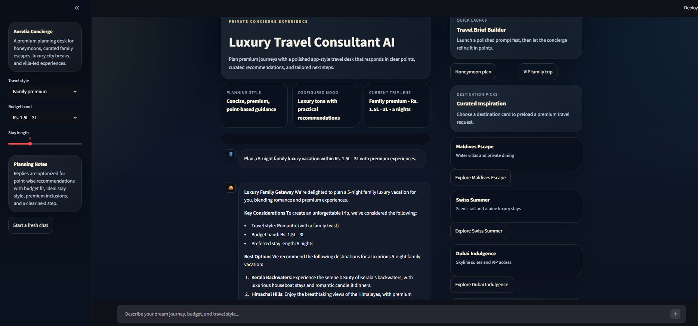

# Luxury Travel Consultant AI

Luxury Travel Consultant AI is a premium travel concierge chatbot built with Streamlit and the Groq API. It delivers a polished app-style UI and luxury-focused recommendations for travelers looking for curated family trips, city indulgence, private escapes, and high-end destination planning.

The assistant is designed to respond like a professional travel advisor: warm, refined, and structured. Instead of long generic replies, it answers in cleaner points covering trip fit, premium options, estimated budget, perks, and the next best step.

## Screenshot

Save your app screenshot at:

`assets/luxury-travel-app.png`

Then this image will render automatically on GitHub:



## Preview

- App-style Streamlit interface
- Luxury-focused concierge tone
- Point-wise travel recommendations
- Quick destination prompts and trip presets
- Personalized responses using budget, stay length, and travel style

## Features

- Modern two-column layout with sidebar controls
- Premium visual styling for a more product-like experience
- Curated destination cards for fast prompt launching
- Structured AI responses for better readability
- Travel-profile-aware prompt enrichment before model generation
- Discount eligibility guidance with premium value-add alternatives

## Tech Stack

- Python
- Streamlit
- Groq API
- `python-dotenv`

## Project Structure

```text
luxury-travel-ai/
|-- app.py
|-- chatbot.py
|-- prompt.py
|-- requirements.txt
|-- README.md
`-- .env
```

## How It Works

1. `app.py` renders the travel concierge interface with a chat workspace, sidebar filters, and quick prompt cards.
2. `prompt.py` defines the personality and business rules for the luxury travel assistant.
3. `chatbot.py` sends the conversation to Groq using the `llama-3.3-70b-versatile` model.
4. The UI enriches the user message with selected travel preferences such as budget band, trip style, and length of stay.
5. The assistant returns a cleaner, point-based luxury recommendation.

## Response Style

The assistant is tuned to answer in a way that feels useful for travel planning:

- Short sections instead of big text blocks
- Bullet points for clarity
- Luxury-only suggestions
- Helpful follow-up questions when trip details are missing
- A clear next step at the end of each response

## Setup

### 1. Install dependencies

```bash
pip install -r requirements.txt
```

### 2. Add your API key

Create a `.env` file in the project root:

```env
GROQ_API_KEY=your_api_key_here
```

### 3. Start the app

```bash
streamlit run app.py
```

## Example Use Cases

- Planning a Maldives luxury getaway with water villa preferences
- Suggesting a luxury Switzerland or Dubai itinerary
- Simulating a concierge chatbot for a premium travel agency
- Showcasing a polished AI demo with better UI and better answer formatting

## Example Prompts

```text
I want a luxury Maldives package with a private pool villa.
```

```text
Plan a 5-night premium family vacation in Dubai with fine dining and private transfers.
```

```text
Can you suggest a luxury Switzerland itinerary for 6 nights with scenic trains and lake-view hotels?
```

```text
Can I get a discount on my booking, and if not, what premium perks can you offer?
```

## Example Response

```text
Overview
- Maldives is an excellent choice for a premium luxury escape.
- A refined 4 to 5-night experience usually works well for privacy, relaxation, and curated dining.

Best options
- Private pool beach villa for spacious comfort and direct beach access
- Overwater villa for a more iconic Maldives experience
- Resort package with speedboat or seaplane transfers included

Estimated budget
- Luxury stays typically begin from Rs. 1.5L+ for a refined short stay
- Higher-end all-inclusive or private-pool experiences can go significantly above that

Recommended perks
- Candlelit dinner by the beach
- Complimentary spa credit
- Sunset cruise or underwater dining experience

Next step
- Share your travel month, total budget, and number of nights, and I will narrow down the best-fit option.
```

## Demo Conversation

```text
User:
I want a luxury Maldives package.

Assistant:
Overview
- Maldives is a beautiful choice for a premium island escape.
- I can help you plan a refined stay with privacy, curated dining, and memorable experiences.

To tailor the best option, please share:
- Your approximate total budget
- Preferred number of nights
- Whether you prefer a beach villa or overwater villa

Next step
- Once you share those details, I can suggest the best-fit package in points.

User:
My budget is around Rs. 2.5L for 4 nights, and I prefer an overwater villa.

Assistant:
Overview
- That budget can work well for a premium 4-night Maldives stay, depending on the resort and transfer type.

Best options
- Entry luxury overwater villa with breakfast and speedboat transfer
- Premium resort stay with private deck, lagoon access, and curated add-ons
- Refined half-board stay if you want better dining inclusion

Recommended perks
- Private beach dinner
- Signature spa experience
- Sunset cruise with champagne

Next step
- If you want, I can now create a more detailed package suggestion with inclusions and an ideal resort style.
```

## Files Explained

- [app.py](./app.py): Main Streamlit application and UI layout
- [chatbot.py](./chatbot.py): Groq client initialization and response generation
- [prompt.py](./prompt.py): System prompt, travel rules, and response style instructions
- [requirements.txt](./requirements.txt): Required Python packages

## Future Improvements

- Add package cards with sample pricing
- Add itinerary tabs for day-by-day plans
- Support chat history export
- Add booking inquiry or lead capture forms
- Integrate hotel, weather, or flight APIs
- Add destination images and richer package summaries

## Notes

- This project is best suited for demos, prototypes, and travel AI experiments.
- Model-generated travel prices and destination advice should be reviewed before using them in a real production travel workflow.
